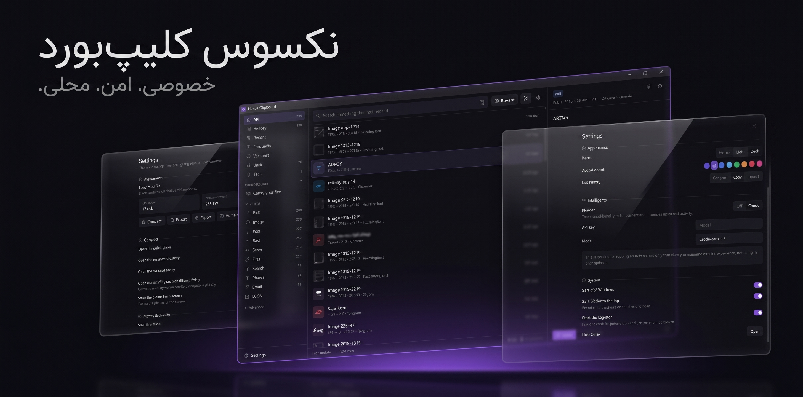

<div align="center" dir="rtl">

# نکسوس کلیپ‌بورد (Nexus Clipboard)

### منیجر کلیپ‌بورد فوق‌سریع، امن و کاملاً محلی (Local-First) برای ویندوز

[](https://www.rust-lang.org/)
[](https://v2.tauri.app/)
[](https://react.dev/)
[](https://tailwindcss.com/)
[](https://sqlite.org/)
[](LICENSE)
[](https://github.com/nexouya/nexus-clipboard/releases/latest)

<br/>

<a href="https://github.com/nexouya/nexus-clipboard/releases/latest">
  
</a>

<br/><br/>



<br/>

[**مستندات انگلیسی (English README)**](README.md) | [**مستندات فارسی (Persian README)**](README.fa.md)

</div>

---

**نکسوس کلیپ‌بورد (Nexus Clipboard)** یک ابزار مهندسی‌شده و مدرن برای ارتقای بهره‌وری روزمره توسعه‌دهندگان و کاربران حرفه‌ای است؛ برای تمام کسانی که از برنامه‌های سنگین، کند و ناامن مبتنی بر Electron یا ابزارهای بسته‌ای که داده‌های کلیپ‌بورد را به سرورهای ابری ارسال می‌کنند، خسته شده‌اند.

هر محتوایی که کپی می‌کنید — از متن ساده، لینک، کدهای برنامه‌نویسی، تصاویر اسکرین‌شات با کیفیت بالا، لیست فایل‌ها تا رمزها و توکن‌های حساس — بلافاصله دریافت، دسته‌بندی و ایندکس شده و در کسری از میلی‌ثانیه برای استفاده مجدد در دسترس است؛ بدون اینکه حتی یک بایت داده از سیستم شما خارج شود.

---

## ⚡ چرا نکسوس کلیپ‌بورد؟

اکثر کلیپ‌بورد منیجرهای فعلی یا برنامه‌های حجیم با اشغال چندصد مگابایت رم هستند که با Polling مداوم باتری و پردازنده را درگیر می‌کنند، یا امنیت پایینی برای کلیدها و پسوردها دارند. نکسوس بر پایه اصول مهندسی دقیق طراحی شده است:

- **مصرف پردازنده عملاً صفر (0.0% CPU Idle)**: به جای ایجاد لوپ و Polling مکرر، مستقیماً از Win32 API نیتیو ویندوز (`AddClipboardFormatListener`) استفاده شده است. هسته برنامه در حالت آماده‌باش کاملاً خواب است و فقط با رخداد کپی بیدار می‌شود.
- **ثبت در کسری از میکروثانیه و حذف هوشمند موارد تکراری**: هش محتوا بر پایه الگوریتم قدرتمند **BLAKE3** محاسبه می‌شود. کپی مجدد یک آیتم قبلی، بدون اشغال فضای اضافه، همان آیتم را به صدر تاریخچه منتقل می‌کند.
- **تفکیک رمزنگاری‌شده داده‌های حساس**: داده‌های محرمانه (کلیدهای AWS، توکن‌های GitHub، کدهای JWT، پرایوت کی‌ها، شماره کارت و کانکشن استرینگ‌ها) با موتور Regex هوشمند شناسایی، ماسک و با متد پیشرفته **XChaCha20-Poly1305** رمزنگاری می‌شوند و هرگز به صورت متن باز وارد ایندکس جستجو نخواهند شد.
- **جستجوی O(1) در میلیون‌ها رکورد**: جستجوی متنی سریع به لطف جدول اکسترنال SQLite FTS5، الگوریتم رتبه‌بندی BM25 و صفحه‌بندی مبتنی بر Keyset (بدون استفاده از دستور کند `OFFSET`).
- **هوش مصنوعی چندمنظوره با پشتیبانی از همه ارائه‌دهنده‌ها**: قابلیت اتصال به آنتراپیک (Claude)، اوپن‌ای‌آی (OpenAI) و هر سرور یا مدل سازگار با OpenAI (مثل Ollama لوکال، DeepSeek، OpenRouter، LM Studio) با آدرس دلخواه. (به صورت پیش‌فرض کاملاً خاموش است).

---

## 🛠️ معماری و پشته فناوری

```
┌──────────────────────────────────────────────────────────────┐
│                  لایه رابط کاربری (Webview)                  │
│       React 19 • TypeScript (Strict) • Tailwind CSS v4       │
│             Zustand State • TanStack Virtual List            │
└──────────────────────────────┬───────────────────────────────┘
                               │ دستورات و ایونت‌های IPC
┌──────────────────────────────▼───────────────────────────────┐
│                    هسته برنامه (Rust / Tauri 2)              │
├──────────────────────────────────────────────────────────────┤
│  ipc/       │ کنترل‌کننده‌های تایپ‌شده Tauri و انتقال ایونت‌ها │
│  app/       │ مدیریت رویدادها، تری ویندوز، شورتکات و وضعیت  │
│  features/  │ فرآیند ضبط کلیپ‌بورد، پیست، پشتیبان‌گیری و AI │
│  domain/    │ ساختار داده‌ها، طبقه‌بندی و منطق خالص برنامه    │
│  infra/     │ تعامل با SQLite، ذخیره‌سازی فایل‌ها و Win32 API│
└──────────────────────────────────────────────────────────────┘
```

| لایه | تکنولوژی‌های مورد استفاده | دلیل انتخاب |
|---|---|---|
| **بک‌اند و هسته نیتیو** | Rust, Tauri 2.x, Win32 API | امنیت حافظه، سرعت زبان سی، مصرف حافظه رم فوق‌العاده پایین (~۳۵ مگابایت) |
| **موتور دیتابیس** | SQLite 3 با افزونه FTS5 و r2d2 | دیتابیس امبدد تراکنشی، حالت پرسرعت WAL، بدون نیاز به نصب هیچ سرویس اضافه |
| **ذخیره‌سازی تصاویر** | Content-Addressed Blob Storage | نگهداری فایل‌های باینری و تصاویر بزرگ بر اساس هش برای جلوگیری از اشغال فضای تکراری |
| **رمزنگاری امن** | `argon2`, `chacha20poly1305`, `zeroize` | رمزنگاری مدرن و ضد نفوذ؛ کلیدهای رندوم ۱۹۲ بیتی غیرقابل پیش‌بینی |
| **فرانت‌اند و کامپوننت‌ها**| React 19, TypeScript 5.9, Vite 7 | مدل رندرینگ مدرن ری‌اکت بدون بار اضافی روی سیستم |
| **مجازی‌سازی لیست** | `@tanstack/react-virtual` | اسکرول روان هزاران رکورد بدون افت فریم و بدون سنگین شدن DOM |
| **استایل و طراحی** | Tailwind CSS v4, فضای رنگی OKLCH | پالت‌های رنگی دقیق و هماهنگ، دارک مود واقعی و امکان انتخاب رنگ اَکسِنت |

---

## ✨ امکانات و قابلیت‌ها

### ۱. تشخیص و دسته‌بندی هوشمند
- **طبقه‌بندی لحظه‌ای فرمت‌ها**: تفکیک هوشمند متن، پیوند اینترنتی، ایمیل، شماره تماس، کدهای رنگی (HEX/RGB)، فایل جیسون (JSON)، اسکرین‌شات و سورس‌کد با تشخیص خودکار بیش از ۱۵ زبان برنامه‌نویسی.
- **محافظت از اطلاعات هویتی و امنیتی**: تشخیص و ماسک‌کردن کلیدها و توکن‌های حساس به صورت رمزنگاری‌شده.
- **لیست سیاه برنامه‌ها (Ignore List)**: ممانعت خودکار از ثبت محتوای کپی‌شده از نرم‌افزارهای مدیریت رمز (1Password, Bitwarden, KeePassXC و...).

### ۲. جستجوی آنی و فیلترهای کاربردی
- **جستجوی تمام‌متن FTS5**: جستجو بر اساس کلمات، پیشوندها و برچسب‌ها با سرعت لحظه‌ای.
- **دسته‌بندی‌های هوشمند**: دسترسی سریع به نشان‌شده‌ها (Pinned)، موارد محبوب (Favorites)، کپی‌های امروز، گاوصندوق رمزها (Vault)، فایل‌های بزرگ، موارد پرکاربرد و سطل زباله.

### ۳. کلیدهای میانبر عمومی و ارگونومی کاربری
- `Ctrl+Shift+V`: باز شدن سریع لانچر شناور برای انتخاب و پیست فوری محتوا.
- `Ctrl+Shift+B`: پیست آنی آیتم قبلی بدون باز شدن هیچ پنجره‌ای (کاربردی برای جابه‌جایی سریع میان دو مقدار).
- `Ctrl+Shift+P` یا `Ctrl+K`: باز کردن پالت دستورات سراسری.

### ۴. ۲۱ ابزار پردازش و تبدیل متن آفلاین
- تغییر ساختار شناسه‌ها (`camelCase`، `snake_case`، `kebab-case`، `slugify`).
- تبدیل حروف (بزرگ، کوچک، ابتدای جملات، حذف فاصله‌های اضافه و یکدست‌سازی تورفتگی خطوط).
- انکود و دیکود (Base64، URL Encode، فرمت‌بندی و فشرده‌سازی JSON).
- ابزارهای خطوط (مرتب‌سازی الفبایی، معکوس‌سازی خطوط، حذف خطوط تکراری، شمارش کلمات و کاراکترها).

### ۵. هوش مصنوعی بدون وابستگی و قابل پیکربندی
- پشتیبانی از پروتکل رسمی **Anthropic Claude** و همچنین **OpenAI**.
- قابلیت تنظیم **Custom Base URL** و استفاده از مدل‌های دلخواه (مثل اتصال به مدل‌های لوکال در Ollama با `http://localhost:11434/v1` یا DeepSeek و OpenRouter).
- خلاصه سازی، توضیح محتوا و ترجمه با یک کلیک (بدون ارسال داده‌های دیگر دیتابیس).

---

## ⌨️ راهنمای کلیدهای میانبر

### میانبرهای عمومی (در هر کجای ویندوز)
| کلید میانبر | عملکرد |
|---|---|
| `Ctrl+Shift+V` | باز کردن پنجره لانچر شناور |
| `Ctrl+Shift+B` | پیست مستقیم آیتم قبلی |
| `Ctrl+Shift+P` | باز کردن پالت دستورات |

### پنجره اصلی برنامه
| کلید | عملکرد |
|---|---|
| `Ctrl+F` یا `/` | رفتن به کادر جستجو |
| `↑` / `↓` یا `j` / `k` | جابه‌جایی در لیست آیتم‌ها |
| `Enter` | کپی یا پیست آیتم انتخاب‌شده |
| `p` | پین کردن یا لغو پین |
| `Delete` | انتقال به سطل بازیافت |
| `Ctrl+,` | باز کردن بخش تنظیمات |
| `Esc` | بستن پنجره یا خروج از حالت انتخاب |

---

## 🚀 راه‌اندازی و توسعه محلی

### پیش‌نیازها
- **ویندوز ۱۰ یا ۱۱** (معماری ۶۴ بیتی)
- **کامپایلر Rust** (نسخه ۱.۸۰ به بالا): قابل نصب از طریق `https://rustup.rs`
- **محیط اجرایی Node.js** (نسخه ۲۰ به بالا) و پکیج منیجر **pnpm**
- **Microsoft WebView2** (به صورت پیش‌فرض در ویندوز ۱۱ نصب است)

### مراحل بیلد و اجرای پروژه

۱. **کلون کردن ریپازیتوری**:
   ```bash
   git clone https://github.com/nexouya/nexus-clipboard.git
   cd nexus-clipboard
   ```

۲. **نصب وابستگی‌های فرانت‌اند**:
   ```bash
   pnpm install
   ```

۳. **اجرای نسخه توسعه با قابلیت Hot-Reload**:
   ```bash
   pnpm app:dev
   ```

۴. **کامپایل نسخه نهایی (Production)**:
   ```bash
   pnpm app:build
   ```
   *فایل نصبی استاندارد NSIS و MSI در مسیر `src-tauri/target/release/bundle/` خروجی گرفته می‌شود.*

---

## 🔒 حریم خصوصی و امنیت داده‌ها

۱. **کاملاً آفلاین و Local-First**: هیچ سرور متمرکز، حساب کاربری و سیستم جمع‌آوری داده و تلمتری در نکسوس وجود ندارد. تمام اطلاعات روی درایو شما در مسیر `%APPDATA%\dev.nexus.clipboard` نگهداری می‌شود.
۲. **رمزنگاری تاییدشده**: از استاندارد ۲۵۶ بیتی XChaCha20-Poly1305 استفاده می‌شود و در صورت تمایل کاربر، امکان تعریف پسورد و بازرمزنگاری امن داده‌ها وجود دارد.
۳. **امنیت ایندکس سرچ**: متن خام سکرت‌ها هرگز به موتور جستجو سپرده نمی‌شود و فقط پیش‌نمایش ستاره‌دار ذخیره می‌گردد.

---

## 📄 لایسنس

این پروژه به عنوان یک نرم‌افزار آزاد تحت مجوز معتبر **GNU Affero General Public License v3.0 (AGPL-3.0)** منتشر شده است. برای مطالعه متن کامل به فایل `LICENSE` مراجعه نمایید.
