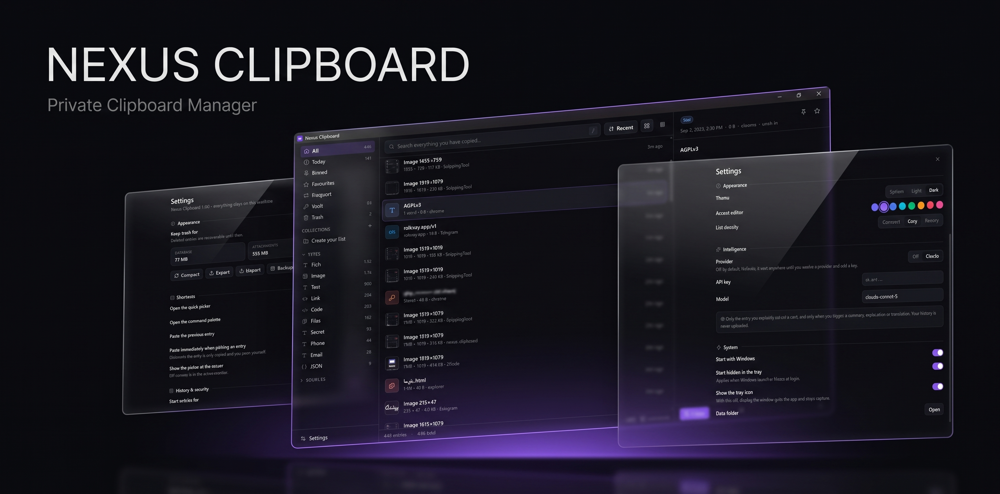

<div align="center">

# Nexus Clipboard

### A blazing-fast, private, local-first clipboard engine for Windows.

[](https://www.rust-lang.org/)
[](https://v2.tauri.app/)
[](https://react.dev/)
[](https://tailwindcss.com/)
[](https://sqlite.org/)
[](LICENSE)
[](https://github.com/nexouya/nexus-clipboard/releases/latest)

<br/>

<a href="https://github.com/nexouya/nexus-clipboard/releases/latest">
  
</a>

<br/><br/>



</div>

---

<details id="fa-lang">
<summary><b>🇮🇷 برای مطالعه مستندات به زبان فارسی کلیک کنید (Click here for Persian Documentation)</b></summary>

<div dir="rtl" align="right">

<br/>

<div align="center">

</div>

<br/>

**نکسوس کلیپ‌بورد (Nexus Clipboard)** یک ابزار مهندسی‌شده و مدرن برای ارتقای بهره‌وری روزمره توسعه‌دهندگان و کاربران حرفه‌ای است؛ برای تمام کسانی که از برنامه‌های سنگین، کند و ناامن مبتنی بر Electron یا ابزارهای بسته‌ای که داده‌های کلیپ‌بورد را به سرورهای ابری ارسال می‌کنند، خسته شده‌اند.

هر محتوایی که کپی می‌کنید — از متن ساده، لینک، کدهای برنامه‌نویسی، تصاویر اسکرین‌شات با کیفیت بالا، لیست فایل‌ها تا رمزها و توکن‌های حساس — بلافاصله دریافت، دسته‌بندی و ایندکس شده و در کسری از میلی‌ثانیه برای استفاده مجدد در دسترس است؛ بدون اینکه حتی یک بایت داده از سیستم شما خارج شود.

### ⚡ چرا نکسوس کلیپ‌بورد؟

- **مصرف پردازنده عملاً صفر (0.0% CPU Idle)**: به جای ایجاد لوپ و Polling مکرر، مستقیماً از Win32 API نیتیو ویندوز (`AddClipboardFormatListener`) استفاده شده است. هسته برنامه در حالت آماده‌باش کاملاً خواب است و فقط با رخداد کپی بیدار می‌شود.
- **ثبت در کسری از میکروثانیه و حذف هوشمند موارد تکراری**: هش محتوا بر پایه الگوریتم قدرتمند **BLAKE3** محاسبه می‌شود. کپی مجدد یک آیتم قبلی، بدون اشغال فضای اضافه، همان آیتم را به صدر تاریخچه منتقل می‌کند.
- **تفکیک رمزنگاری‌شده داده‌های حساس**: داده‌های محرمانه (کلیدهای AWS، توکن‌های GitHub، کدهای JWT، پرایوت کی‌ها، شماره کارت و کانکشن استرینگ‌ها) با موتور Regex هوشمند شناسایی، ماسک و با متد پیشرفته **XChaCha20-Poly1305** رمزنگاری می‌شوند و هرگز به صورت متن باز وارد ایندکس جستجو نخواهند شد.
- **جستجوی O(1) در میلیون‌ها رکورد**: جستجوی متنی سریع به لطف جدول اکسترنال SQLite FTS5، الگوریتم رتبه‌بندی BM25 و صفحه‌بندی مبتنی بر Keyset (بدون استفاده از دستور کند `OFFSET`).
- **هوش مصنوعی چندمنظوره با پشتیبانی از همه ارائه‌دهنده‌ها**: قابلیت اتصال به آنتراپیک (Claude)، اوپن‌ای‌آی (OpenAI) و هر سرور یا مدل سازگار با OpenAI (مثل Ollama لوکال، DeepSeek، OpenRouter، LM Studio) با آدرس دلخواه. (به صورت پیش‌فرض کاملاً خاموش است).

### ✨ قابلیت‌های کلیدی

1. **دسته‌بندی هوشمند**: تفکیک آنی متن، پیوند، ایمیل، شماره تماس، کد رنگی، JSON، اسکرین‌شات و سورس‌کد با تشخیص ۱۵ زبان مختلف.
2. **محافظت از سکرت‌ها و پسوردها**: ماسک‌سازی و ذخیره کاملاً کریپتوگرافیک با قابلیت تنظیم پس‌فریز بر روی گاوصندوق داده‌ها.
3. **لیست سیاه برنامه‌ها (Ignore List)**: فیلتر کردن اتوماتیک نرم‌افزارهای مدیریت رمز (مانند 1Password, Bitwarden, KeePassXC).
4. **کلیدهای میانبر سراسری**:
   - `Ctrl+Shift+V`: لانچر شناور برای انتخاب و پیست فوری.
   - `Ctrl+Shift+B`: پیست آنی آیتم قبلی در پس‌زمینه بدون باز کردن پنجره.
   - `Ctrl+Shift+P` / `Ctrl+K`: پالت دستورات سراسری.
5. **۲۱ تبدیل و پردازشگر متن کاملاً آفلاین**: کیس کانورژن (`camelCase`, `snake_case`, `kebab-case`)، انکودینگ (Base64, URL, JSON Pretty/Minify)، فیلتر خطوط تکراری و مرتب‌سازی.

### 🚀 شروع سریع و راه‌اندازی

```bash
git clone https://github.com/nexouya/nexus-clipboard.git
cd nexus-clipboard
pnpm install
pnpm app:dev
```

کامپایل فایل نصبی نهایی (ویندوز ۱۰ و ۱۱):
```bash
pnpm app:build
```

### 🔒 امنیت و حریم خصوصی
داده‌ها در مسیر `%APPDATA%\dev.nexus.clipboard` ذخیره می‌شوند. بدون سرور، بدون تلمتری، بدون ترک سیستم شما.

---

</div>
</details>

---

Nexus Clipboard is an engineered-to-order productivity utility built for developers, power users, and anyone who refuses to accept sluggish, bloated, or cloud-leaking clipboard history managers.

Everything copied — formatted text, links, code snippets, high-resolution screenshots, files, and credentials — is immediately ingested, auto-classified, indexed, and available for instantaneous retrieval without leaving your machine.

---

## ⚡ Why Nexus?

Most modern clipboard managers fall into one of two traps: either they are sluggish Electron shells consuming 600 MB of RAM while polling the clipboard every 500 ms, or closed-source utilities that upload history to third-party sync backends.

Nexus is built with architectural discipline:
- **0.0% Idle CPU**: Built directly on top of the native Windows API via `AddClipboardFormatListener`. Nexus sleeps silently and only wakes up when the OS fires a genuine clipboard event.
- **Microsecond Ingestion & BLAKE3 Deduplication**: Captures are hashed and deduplicated on the fly. Re-copying an existing snippet surfaces it instantly to the top without fragmenting disk storage.
- **Cryptographic Separation of Sensitive Data**: Passwords, bearer tokens, AWS credentials, and private keys are detected via regex heuristics and encrypted at rest with **XChaCha20-Poly1305** using **Argon2id** key derivation. Plaintext secrets are strictly blocked from entering the search index.
- **O(1) Search Across Millions of Entries**: Full-text search is powered by an external SQLite FTS5 table with BM25 relevance ranking and cursor-based keyset pagination.
- **Universal Provider-Agnostic Intelligence**: Optional AI transforms supporting Claude (Anthropic), OpenAI, and any custom/local OpenAI-compatible endpoint (Ollama, DeepSeek, OpenRouter, LM Studio). Fully disabled by default — nothing is sent anywhere unless explicitly prompted.

---

## 🛠️ Tech Stack & Engineering

```
┌──────────────────────────────────────────────────────────────┐
│                    Frontend (Webview Layer)                  │
│       React 19 • TypeScript (Strict) • Tailwind CSS v4       │
│             Zustand State • TanStack Virtual List            │
└──────────────────────────────┬───────────────────────────────┘
                               │ IPC Commands / Events
┌──────────────────────────────▼───────────────────────────────┐
│                    Core Engine (Rust / Tauri 2)              │
├──────────────────────────────────────────────────────────────┤
│  ipc/       │ Typed Tauri invoke handlers & event emitter    │
│  app/       │ Win32 composition: tray, hotkeys, window state │
│  features/  │ Capture pipeline, paste, backup, AI transforms │
│  domain/    │ Pure entities, classifier & query compilers    │
│  infra/     │ SQLite (r2d2), Sharded Blob Store, Win32 API   │
└──────────────────────────────────────────────────────────────┘
```

| Layer | Technologies | Rationale |
|---|---|---|
| **Backend & Runtime** | Rust, Tauri 2.x, Win32 API | Native OS performance, memory safety, minimal memory footprint (~35MB) |
| **Storage Engine** | SQLite 3 (Bundled), FTS5, r2d2 pool | Embedded transactional database, zero-dependency, crash-resilient WAL mode |
| **Binary Store** | Sharded Content-Addressed Blob Storage | Deduplicates identical screenshots; prevents filesystem inode saturation |
| **Cryptography** | `argon2`, `chacha20poly1305`, `zeroize` | Audited modern cryptography; 192-bit nonce avoids collision hazards |
| **Frontend Framework** | React 19, TypeScript 5.9 (Strict), Vite 7 | Modern reactive model with zero compiler overhead |
| **Virtualization** | `@tanstack/react-virtual` | Seamlessly renders thousands of items without DOM node bloat |
| **Styling & Tokens** | Tailwind CSS v4, OKLCH Color Space | Perceptually uniform palette, dynamic accenting, instant theme switching |

---

## ✨ Features

### 1. Ingestion & Intelligent Classifier
- **Automatic Format Recognition**: Distinguishes plain text, hyperlinks, email addresses, colors (Hex/RGB/HSL), formatted JSON, and code across 15+ programming languages.
- **Credential Quarantine**: Automatically detects GitHub tokens (`ghp_`), AWS keys (`AKIA`), private keys, JWTs, database connection strings, and Luhn-validated credit card numbers, immediately masking and encrypting them.
- **Ignore List**: Native exclusion for major password managers (1Password, Bitwarden, KeePassXC, Dashlane, etc.) and custom executables.

### 2. Instant Retrieval & Search
- **Full-Text BM25 Search**: Matches across prefixes, words, and meta tags with zero indexing delay.
- **Smart Filter Collections**: Quick views for Pinned, Favourites, Today, Vault (encrypted), Frequent, Large files, and Trash.
- **Keyset Pagination**: Eliminates costly SQL `OFFSET` operations; page 100 loads as quickly as page 1.

### 3. Workflow & Global Hotkeys
- `Ctrl+Shift+V`: Invokes the lightweight **Quick Picker Launcher** centered or at cursor position.
- `Ctrl+Shift+B`: Direct background paste of the previous clipboard entry without opening the UI.
- `Ctrl+Shift+P` / `Ctrl+K`: Global command palette for rapid navigation and actions.

### 4. 21 Offline Text Transformations
- **Identifiers**: `camelCase`, `snake_case`, `kebab-case`, `slugify`.
- **Text & Case**: UPPERCASE, lowercase, Title Case, Sentence case, whitespace collapse, indentation dedenting.
- **Encoding**: Base64 encode/decode, URL encode/decode, JSON pretty-print & minify.
- **Line Utilities**: Sort lines, reverse lines, deduplicate lines, line & word counter.

### 5. Configurable AI Intelligence
- Connect to **Anthropic Claude**, **OpenAI**, or **Any Custom Base URL** (e.g. `http://localhost:11434/v1` for local Ollama, DeepSeek, or OpenRouter).
- Single-entry transformations: One-click Summarize, Explain Code, and Translate.
- Strict Privacy: Zero telemetry, zero automated uploads.

---

## ⌨️ Shortcuts Reference

### Global (Anywhere in Windows)
| Hotkey | Action |
|---|---|
| `Ctrl+Shift+V` | Open Quick Picker Launcher |
| `Ctrl+Shift+B` | Quick-paste previous item directly |
| `Ctrl+Shift+P` | Open Command Palette |

### Main Window
| Key | Action |
|---|---|
| `Ctrl+F` or `/` | Focus search bar |
| `↑` / `↓` or `j` / `k` | Navigate items list |
| `Enter` | Copy / Paste active item |
| `p` | Toggle Pin |
| `Delete` | Move item to Trash |
| `Ctrl+,` | Open Settings |
| `Esc` | Clear selection / Dismiss |

---

## 🚀 Getting Started

### Prerequisites
- **Windows 10 / 11** (x64)
- **Rust toolchain** (1.80+): `https://rustup.rs`
- **Node.js** (v20+) & **pnpm**: `npm install -g pnpm`
- **WebView2 Runtime** (comes pre-installed on Windows 11)

### Installation & Development

1. **Clone the repository**:
   ```bash
   git clone https://github.com/nexouya/nexus-clipboard.git
   cd nexus-clipboard
   ```

2. **Install frontend dependencies**:
   ```bash
   pnpm install
   ```

3. **Start development environment (Hot Reload)**:
   ```bash
   pnpm app:dev
   ```

4. **Compile production release**:
   ```bash
   pnpm app:build
   ```
   *The optimized NSIS and MSI installers will be generated under `src-tauri/target/release/bundle/`.*

---

## 🔒 Security & Privacy Model

1. **Local-First By Design**: There is no remote account, no analytics daemon, and no remote telemetry ping. All SQLite database files and blob stores live inside `%APPDATA%\dev.nexus.clipboard`.
2. **Cryptographic Vault**: Uses 256-bit XChaCha20-Poly1305 authenticated encryption. The encryption key is derived using Argon2id with random 192-bit nonces.
3. **FTS Sanitization**: Sensitive credential plaintext is never handed to SQLite FTS5; only masked previews are written to the index.
4. **Webview Hardening**: In production builds, developer shortcuts (F5, Ctrl+R) and native context menus are suppressed to prevent webview inspection or accidental reloading.

---

## 📄 License

Distributed under the **GNU Affero General Public License v3.0 (AGPL-3.0)**. See `LICENSE` for the complete license text.
